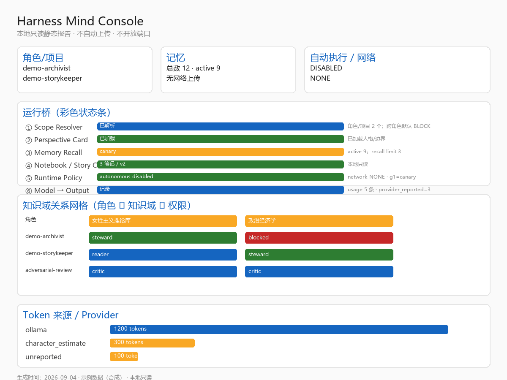

# Harness Core Portable

> **让 AI 记得该记得的，隔离不该串的；你随时看得见、改得动、删得掉。**

> 这套本地“心智 / 记忆 / 情感”核心可以**迁移、审计、回滚**，给 agent、桌宠、角色扮演和长程任务用。
> 它做的是让“关系型 AI 界面”**更稳定、更连续、更可信任**。

```text
版本：v0.1.0-alpha.3
状态：alpha / WIP
License：MIT
Python：3.13+
```

## 先别研究架构：一分钟确认它有没有用

**它只解决一件很具体的事：让长期使用的 AI 不再每次都像失忆，同时不把所有角色和项目的记忆搅在一起。**

```bash
python harness.py demo --offline
```

没有模型、没有 API key 也能运行。你会看到一条完整而可验证的过程：

```text
Alice 记住“蓝色钥匙在旧港钟楼下”
  → 重新打开会话，仍能召回
  → Bob 无法读取 Alice 的私人记忆
  → 两个角色可以共享世界设定，但不共享全部私事
  → 用户把“蓝色”纠正为“银色”
  → 可以查看版本并恢复
  → 临时 Demo 数据自动删除
```

运行结束会明确告诉你：

```text
自动执行：DISABLED
网络上传：NONE
Demo 数据：已自动清理
```

还没下载？选最省事的一种：

- **Windows**：下载 ZIP，解压，双击 `开始体验.bat`；
- **命令行**：复制下面三行；
- **只想看代码是否可信**：先运行 `python package_selfcheck.py`。

```bash
git clone https://github.com/bronya-q/harness-core-portable.git
cd harness-core-portable
python harness.py demo --offline
```

> 当前是 alpha，不假装生产就绪；但离线 Demo、失败返回码、数据清理和发布物校验都可以亲自运行。

## 你是不是正在烦这些事？

| 你看到的问题 | 这里给你的东西 |
|---|---|
| 每次开新会话都要重新解释背景 | 分 scope 的跨会话长期记忆 |
| 两个角色互相知道了不该知道的事 | 私有记忆隔离；共享 Story Core 单独管理 |
| AI 记错以后反复引用 | 纠错、版本链、忘记、恢复 |
| 角色只有口癖，没有共同经历 | 处境、关系、共同事件与当前状态的结构化方向 |
| 不知道 AI 为什么提起某段过去 | 来源、召回、策略和事件审计 |
| Agent 做完任务，下次又从头读项目 | 项目记忆、上下文预算和工程交接基础 |
| 害怕 Agent 自动乱改、乱发、乱执行 | fail-closed；高影响自动执行持续禁用 |
| 不知道自己的数据在哪里 | 本地 SQLite、隐私摘要、备份、导出和清理入口 |

## 我现在该点哪里？

| 你的目标 | 只做这一步 | 然后你会得到 |
|---|---|---|
| **先看效果** | `python harness.py demo --offline` | 记忆、隔离、纠错、恢复和自动清理 |
| **看图形化结果** | `python harness.py dashboard build` | 本地只读 HTML 控制台 |
| **管理记忆** | `python harness.py memory list --scope demo` | 可查看、纠正和忘记的记录 |
| **做角色/互动叙事** | 先跑离线 Demo | 再进入 Character、Story Core、Notebook |
| **接现代 Coding Agent** | `python harness.py ecosystem status` | 真实兼容等级；计划项不会冒充已支持 |
| **审计仓库** | `python package_selfcheck.py` | 离线静态检查和明确返回码 |
| **准备贡献** | 阅读 [`CONTRIBUTING.md`](CONTRIBUTING.md) | 测试、UX、安全、评测等贡献入口 |

第一次不用理解所有术语和命令。**先跑 Demo，再按自己的目标只选一条路。**

## 本地 Dashboard 预览


本地只读 HTML 控制台（由 `demo --offline --keep` + `dashboard build` + 无头浏览器生成的**真实合成数据截图**，不包含任何真实用户数据）。运行：

```bash
python harness.py dashboard build
```

会生成一个不开放端口、不自动上传的静态文件，里面包含：
- 彩色运行桥状态条（Scope / Persona / Memory / Policy / Model）
- 知识域关系网格（角色 ↔ 知识域 ↔ 权限）
- 事件来源分组、向量队列、Token Provider 可视化

滚动预览动画（同一张真实 Dashboard 截图自动滚动）：



> 图片来自合成 demo 数据与本地只读 Dashboard，不是屏幕录制；如果你想看真实交互，运行 `python harness.py dashboard build` 后打开生成的文件。

## 角色不应该只是“口癖包”

这里追求的不是让角色多说几句特色台词，而是让用户能够理解：角色**此刻处在什么处境、与用户共同经历过什么、为什么作出当前选择，以及理解错了以后在哪里纠正**。

```text
处境 → 关系 → 共同经历 → 当前状态 → 责任与张力 → 可解释选择 → 表达
```

口癖只在最后一层。记忆、关系与推断应当可见、可质疑、可撤销；“像真人”不等于系统真的理解或具有意识。完整设计见 [`Topics 对齐与切身化角色设计`](docs/tasks/2026-09-04-topics-alignment-and-situated-character-design.md)。


## Works around modern agent workflows

Harness Core Portable focuses on portable project memory, context visibility, scoped state and auditable handoffs.

Planned and experimental integration surfaces include:

- AGENTS.md-based coding agents;
- CLAUDE.md and hook-based workflows;
- MCP-capable agent clients;
- OpenAI-compatible and DeepSeek-powered model backends.

See [Agent Compatibility](docs/AGENT_COMPATIBILITY.md). Compatibility varies by platform; planned adapters are not presented as verified support.

---

## 目录

- [这是什么](#这是什么)
- [为什么值得看](#为什么值得看)
- [快速开始](#快速开始)
- [本地 Dashboard 预览](#本地-dashboard-预览)
- [核心概念](#核心概念)
- [常用命令](#常用命令)
- [效果与边界](#效果与边界)
- [数据与隐私](#数据与隐私)
- [如何贡献/帮忙](#如何贡献帮忙)
- [文档](#文档)
- [License](#license)
- [致谢](#致谢)

---

## 这是什么

一个把“人格一致性、跨会话记忆、关系/情感状态、自进化、门控治理”做成**可复现模块**的工程。

```text
角色扮演 / 长程任务 / 多 agent 协作
        ↓
Humanization H1-H9 / 记忆 / 情感 / 自进化
        ↓
production_gate / mind_review / rating_snapshot
```

它不做聊天前端、不是模型，也不承诺心理效度。

## 为什么值得看

- **可迁移**：纯 Python + SQLite，核心脚本可用 `Path.home()` 适配本机；
- **可审计**：gold / gate / snapshot / hash 都能复现；
- **可回滚**：notebook/story core 支持 restore；
- **有边界**：不自动上传、不写 PII、安全在 harness 代码；
- **不造轮子**：多角色协作用 notebook + story core，而不是让每个角色各写一套记忆。

## 对下游工程的作用（v0.1，基于长期运行与大量下游记录）

这里的“工程”指**在增强心智模型下，agent 做的其他项目**。这套系统已在多个对话/项目中长期运行，并在本地留下了大量下游工程记录（DeepSeek 导出 289 会话 / 2132 条用户消息、AutoMM 省赛、马克斯/布兰奇人格研究、COC/TRPG 人物卡、角色扮演、文档/网页/方案整理等）。

### 作用分类（详细）

#### 1. 制作游戏 / 交互叙事
- 世界观与角色一致性：通过 Perspective Card + story core 保持同一世界设定；
- 剧情连续性：跨会话记忆 + notebook 记录角色经历；
- 防人设漂移：cross_character_consistency + expression DNA；
- 已在 COC/TRPG 人物卡、角色扮演、桌宠/galgame 类场景中使用。

#### 2. 撰写论文 / 研究报告
- 研究主线不丢失：mind_evolution 分目标 + master_tasks；
- 证据可追溯：recall-pool / 记忆检索 / 盲标 gold；
- 多轮材料沉淀：notebook（每研究主题）、deepseek 语料信号；
- 已在马克斯/布兰奇、神经与认知、AutoMM 省赛等研究中产生大量记录。

#### 3. 公司 / 产品网页
- 用户偏好记忆：user_confirmed + user_model signals；
- 多轮需求一致性：story core + notebook 记录需求；
- 成本/资源记录：rating_snapshot / daily_report；
- 可回滚：policy + all-shadow。

#### 4. 文书 / 文档工作
- 长文档注入受控：max_recall_items / max_recall_chars / collab budget；
- 关键信息不丢：事实层（facts）+ 记忆检索；
- 格式稳定：Perspective Card / output discipline。

#### 5. 角色扮演
- 一致性：第一人称自传 + 关系阶段 + 矛盾公式；
- 边界安全：anti_prompt_injection / no_self_reveal / 不主动恋爱化；
- 自然流：natural_session / flow-split；
- 跨角色协作：notebook + story core。

### 设计预期与本地观察（非受控 A/B）

| 场景 | 使用前（无增强心智模型） | 本地观察/预期改善（增强心智模型） |
|---|---|---|
| 角色扮演 | 容易串人、前后矛盾、没记忆 | 同一角色跨会话稳定，记得之前经历，关系/边界可控 |
| 游戏/叙事 | 世界观容易漂移、剧情断档 | story core + notebook 保持世界观连续，角色防漂移 |
| 论文/研究 | 引用/证据容易丢、主线断裂 | 记忆检索 + 目标分层 + 证据可追溯，研究主线可回看 |
| 公司/产品网页 | 需求多轮后容易偏离 | 用户偏好记忆 + notebook 记录需求，偏离可检测 |
| 文书/文档 | 长文档上下文塞爆、关键信息丢 | 受控注入 + 事实层 + 格式稳定 |
| 多 agent 协作 | 各角色各写一套，容易冲突 | notebook + story core 共享世界核心，一致性提升 |

> 这些是**作者观察与本地案例记录**，不是受控 A/B 实验。
> 没有公开抽样方案、前后对照设计、独立评价者、任务成功指标、置信区间或失败样本。
> 它只说明设计中预期改善的方向，不能当作正式效果验证。
> 也不代表“AI 真的理解和在乎”，心理效度仍需正式研究。

### 证据来源（本地，不随仓库公开原文）
```text
DeepSeek 导出语料（289 会话 / 2132 用户消息）
AutoMM 省赛工程记录
本机私人角色/研究案例
COC / TRPG / 角色卡
Obsidian 学习强化库等
```

> 这些是**工程/体验层面的作用**，基于长期运行与大量下游记录；
> 不代表“AI 真的理解或在乎”；心理效度仍需正式研究。
> 详细边界见 `EFFECTS.md`；本地记录清单与“不能证明什么”见 `LOCAL_RECORDS.md`。

## 快速开始

```bash
# 1. 解压/克隆仓库
cd harness-core-portable

# 2. 发布前离线自检（不依赖 Ollama / 私有卡，干净 clone 应通过）
python package_selfcheck.py

# 2b. Windows 用户可直接双击“开始体验.bat”，或运行：
python harness.py start

# 3. 5 分钟离线演示（合成数据，自动清理）
python harness.py demo --offline

# 4. 根目录统一 launcher（自检，失败返回非 0；生产门控未满足时预期失败）
python harness.py audit

# 5. 看政策
python harness.py status

# 6. 内生审查（走 harness review）
python harness.py review run

# 或直接进入核心目录
cd harness-core
python harness.py status
python roleplay_memory_chat.py --help
```

> 可选：本地 Ollama（用于 embedding / LLM / 角色生成）；最小核心不需要 Ollama。

## 核心概念

| 概念 | 说明 |
|---|---|
| Scope | 一个角色 / 项目 / 任务域 |
| Notebook | 每个 scope 的持久笔记本（auto/manual，版本链） |
| Story Core | 多角色/多任务共享的世界核心（可 diff） |
| Perspective Card | 高一致性角色人格卡 |
| Gate | `production_gate.py`（fail-closed） |
| Review | `mind_review.py`（内生审查） |

## 常用命令

```bash
python harness.py demo --offline        # 5 分钟离线可感知演示（合成数据）
python harness.py dashboard build       # 生成本地只读 HTML 控制台
python harness.py memory list --scope s  # 查看某角色/项目经历笔记
python harness.py memory correct --scope s --id <id> --text '...'
python harness.py memory forget --id <id>
python harness.py privacy export          # 导出脱敏隐私摘要
python harness.py backup create           # 创建本地备份
python harness.py feedback export --redacted
python harness.py character list            # 角色资产列表
python harness.py character install <pkg>   # 安装角色包
python harness.py character validate --package <pkg> --target public  # 公共包资格检查
python harness.py character preview <pkg>   # 沙盒预览（不写入）
python harness.py character activate <id>   # 激活角色（事务化，可回滚）
python harness.py character rollback        # 回滚到上一个激活角色
python harness.py character card-import --package card.json --output out --yes  # Character Card 映射
python harness.py character build --from corpus/ --output draft --approve       # 语料→角色草稿审批
python harness.py character mode list --persona demo-archivist  # 情境模式列表
python harness.py character mode switch --persona demo-archivist --mode archival-research
python harness.py character mode current
python harness.py knowledge list            # 知识域绑定
python harness.py workspace create --name demo --role ux-engineer
python harness.py schema list             # 查看统一 schema
python harness.py schema validate --role unified-object-model.example.json
python harness.py event add --scope demo --event-type user_correction
python harness.py event list --limit 5
python harness.py usage record --actual 640 --baseline 18420 --avoided 17780
python harness.py usage list
python harness.py usage summary
python harness.py usage baseline set --baseline-tokens 1000
python harness.py usage baseline check
python harness.py ab role --a unified-object-model.example.json --b knowledge-sources.example.json
python harness.py ab retriever --retriever-a keyword --retriever-b atomic --top-k 5 [--per-query]
python harness.py evidence create --task example-task [--workspace <ws>]
python harness.py evidence handoff --task example-task
python harness.py ecosystem status      # Agent 生态兼容矩阵
python package_selfcheck.py             # 离线/静态发布自检（干净 clone 应通过）
python -m unittest discover              # 标准库功能回归测试
python release_verify.py                # 发布物 SHA-256 清单校验
python harness.py audit                 # 聚合自检（生产门控 fail-closed）
python harness.py notebook note --scope game:demo --text '...' --kind manual
python harness.py notebook restore --scope game:demo --version 1
python harness.py story set --namespace story:game-demo --content '...'
python harness.py story diff --namespace story:game-demo
python harness.py measure congruence --limit 200
python harness.py persona render --name demo-storykeeper --max-tokens 120
python harness.py review run
```

角色扮演注入（受控）：

```bash
python harness.py roleplay \
  --persona demo-alice \
  --prompt '这是什么地方？' \
  --story-namespace 'story:game-demo' \
  --notebook-auto
```

## 效果与边界

- 效果：一致性、连续性、边界安全、可审计性；
- 边界：**不是心理学效度**；工程 proxy ≠ 用户满足度；自然数据仍缺口。

详见：

```text
EFFECTS.md           场景效果与个性化边界
MENTAL_MODEL_EFFECTS.md 心智模型效果说明
NATURAL_DATA_GAP.md  数据缺口与求助
```

## 数据与隐私

- 默认**本地**，不自动上传；
- **不含** PII / API key / 真实对话 / 大模型文件；
- 原用户绝对路径已替换为 `~`；
- 其他用户本地知识库需授权/脱敏。

## 如何贡献/帮忙

- 自然流样本（`natural_session_*.bat`）
- gold 标注（`recall_gold_independent_blind.csv`）
- 下游任务反馈（游戏/论文/网页/文书）
- 安全/许可证核验

见 `CONTRIBUTING.md` / `SECURITY.md` / `NATURAL_DATA_GAP.md`。

<details>
<summary><strong>需要大家一起来（真的，这些我一个人搞不定）</strong> <em>点击展开</em></summary>

这项目做到现在，有些事不是我不想做，是真得有人有真实环境，或者拉上几个活人一起试。如果你愿意搭把手，随便挑一个，先谢了。

### 1. MCP Inspector 实跑

协议 smoke 我已经过了：

```bash
python -m unittest tests.test_mcp_server
```

再下一步就需要有人把服务器在 Inspector 里加载：

```bash
python -m harness_core.adapters.mcp_server
```

这个得开着浏览器/交互环境，我这边干不了。

### 2. Official MCP Registry 提交

材料我备好了：

```text
docs/mcp/server.json
docs/mcp/verification.md
```

就差有人去提 PR + 走审核。不是我偷懒，是这一步本来就得人去提交。

### 3. 真实宿主验证

想麻烦用这些环境的朋友帮忙跑一下 `harness-core-mcp`，记个版本和结论就行：

- Claude Code
- Codex CLI
- GitHub Copilot（VS Code / JetBrains）

### 4. 首次用户测试（这个最缺人）

按 `docs/user-testing/PROTOCOL.md` 找 5 个没碰过这项目的人试一遍，把结果填进 `docs/user-testing/results-template.md`。

哪怕只来 1 个人，也比没人强。

### 5. 双人标注

对 recall gold 做一小批双人标注，算一下 Cohen’s κ。这块是项目“测量学”最弱的一环，有人帮一下会好很多。

### 6. 真实截图 / GIF

现在 README 全是文字，再漂亮也是文字。有空的帮我生成一张合成 Demo 截图，或者一段 20–30 秒离线 Demo GIF。

### 7. CI 与跨平台

哪个平台的 GitHub Actions、Windows/macOS/Linux 矩阵，欢迎来加。

> 愿意做其中任何一项，直接开 Issue 或在 GitHub Discussions 回帖就行。我会把任务拆好、验收标准写清楚。
> 最后，不管大家有没有装，都祝看到的朋友们用 AI 许愿工程一次就成，DSH 版本更新兼容性依旧稳定。

</details>

## 文档

```text
AGENT_USAGE.md          给其他 agent 的使用指南
EFFECTS.md              效果与个性化边界
LOCAL_RECORDS.md        本地记录：有什么、能说明什么、不能说明什么
ROADMAP.md             产品路线与未实现方向：角色资产化/运行桥/上下文成本/控制台/日记内省
KNOWLEDGE_STEWARDSHIP.md  角色化知识治理：知识域、职责、权限与桥图（本机案例为内部参考）
ENGINEERING_ROLES.md    工程角色体系：谁负责规划/实现/测试/审查/发布/维护/恢复
HYBRID_FUNCTIONAL_PERSONA.md  人格化职能角色：公共能力+本机人格（本机案例为内部参考）
RESEARCH.md             研究动机、范式、数据与效果
PRE_MODEL_BASELINE.md   前心智模型基线：本机记忆/md 材料清点与研究建议
local-records-snapshot.public.json  机器可读本地记录快照（脱敏指标）
QUICKSTART.md           English quickstart
RELEASE_NOTES.md        Release notes（v0.1.0-alpha.1 / alpha.2）
AGENT_COMPATIBILITY.md  Agent 生态兼容矩阵（R0/R1/R2）
docs/TASKS_INDEX.md     任务设计文档索引
docs/DEPLOYMENTS_INDEX.md 部署记录索引
docs/templates/         任务设计/部署记录模板
examples/agent-integrations/  AGENTS.md/CLAUDE.md/Codex/DeepSeek/MCP fixtures
docs/user-testing/      首次用户测试协议与结果模板
scripts/create-github-release.sh  GitHub Pre-release 创建脚本（需 gh CLI）
QUICKSTART.zh-CN.md     中文快速开始
开始体验.bat            Windows 双击入口
demo_experience.py       离线可感知演示（合成数据，一键清理）
dashboard.py             本地只读 HTML 控制台生成器
control_commands.py      memory/privacy/backup/feedback 用户控制入口
assets_commands.py      character/knowledge/workspace 资产与工程工作区管理
schema_commands.py      schema list/validate 统一 schema 校验
event_store.py          统一事件信封 / token usage 存储
event_commands.py       event/usage CLI 入口
comparison_commands.py  ab role/retriever + evidence bundle
harness_core/           稳定 Python API（MemoryClient/EventClient/UsageClient）
schemas/situated-mode.schema.json  情境模式 schema
harness-core/personas/demo-modes/  合成角色模式示例
harness_core/adapters/  OpenAI-compatible adapter + MCP server (stdio)
harness_core/measurement_utils.py  bootstrap CI / Cohen's kappa
tests/                  标准库 unittest（API/ecosystem/MCP/activation/measurement）
ecosystem_status.py     生态兼容矩阵状态
schemas/                统一角色/事件/token schema
unified-object-model.example.json  统一对象模型示例
knowledge-sources.example.json  知识源 schema 示例（不含私有正文）
local_records_export.py   本地记录快照生成脚本（需在原始环境运行）
local_records_verify.py  本地记录快照校验脚本
MENTAL_MODEL_EFFECTS.md 心智效果说明
NOTICE.md               第三方许可证义务
CREDITS.md              来源归属
SECURITY.md / CONTRIBUTING.md
```

## License

MIT。第三方许可证/来源见 `NOTICE.md` / `CREDITS.md`。

## 致谢

借鉴/参考：Herta、N.E.K.O.、Mem0、Letta、Kimi/Moonshot、DeepSeek Harness、W博士 Perspective Skill、哥伦比娅角色提示词等。详见 `CREDITS.md`。

---
## 项目预期
谢谢有缘的人能看到这里O+)，由于学业繁忙，接下来可能会每周不定期的更新以下内容：插件效果可视化，角色扮演强化，工程辅助效果强化，兼容性补丁，用户友好尝试，当然以上功能依旧大部分由向AI许愿实现。当然，我也不是很受得了AI的py屎山，大约在下个寒假或暑假会用C/Rust把项目重构一遍（看我在学校学了什么而定，大概），加强一下性能。总之感谢能看到这里的人就是了。
> 如果你在 10 秒内没看出它适合什么，请回去读 [MENTAL_MODEL_EFFECTS.md](MENTAL_MODEL_EFFECTS.md) —— 它最诚实。
